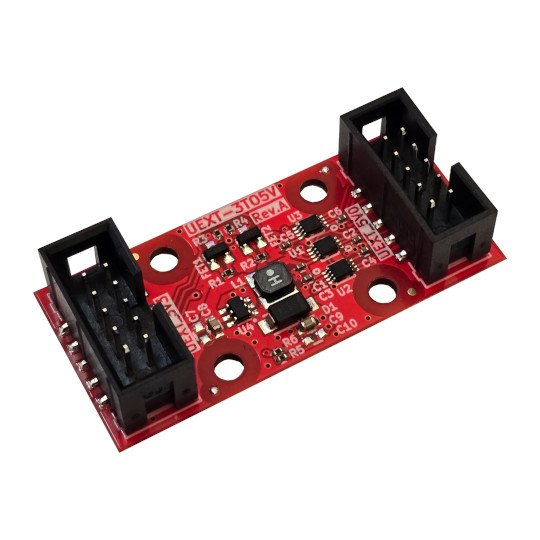

# UEXT-3TO5V
UEXT to UEXT converter from 3V host to 5V devices

https://www.olimex.com/Products/Modules/Adapters/UEXT-3TO5V/open-source-hardware

## Licensee
* Hardware is released under CERN Open Hardware Licence Version 2 - Strongly Reciprocal
* Documentation is released under CC BY-SA 4.0